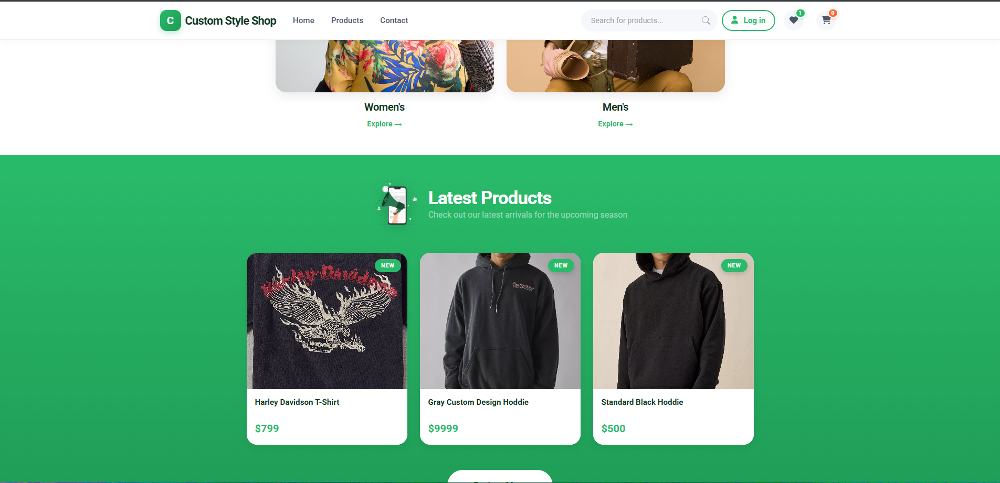
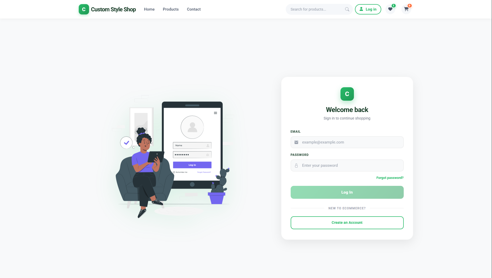
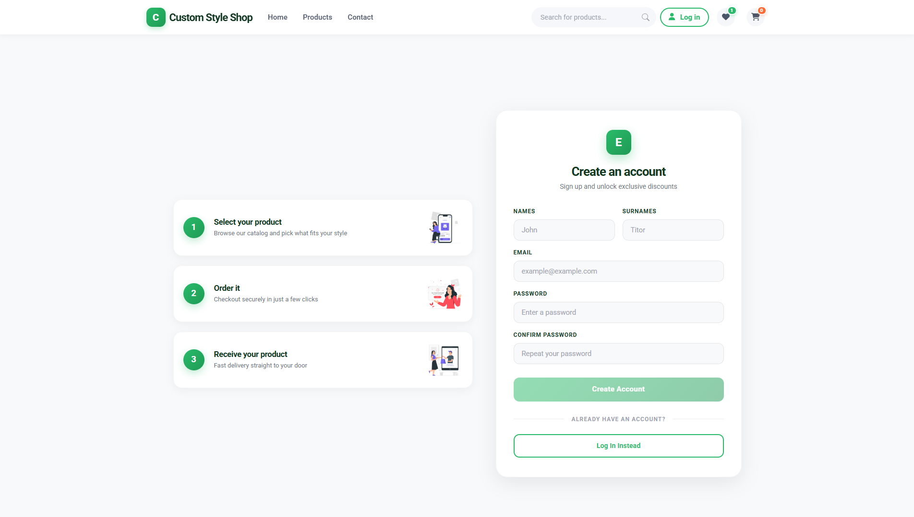
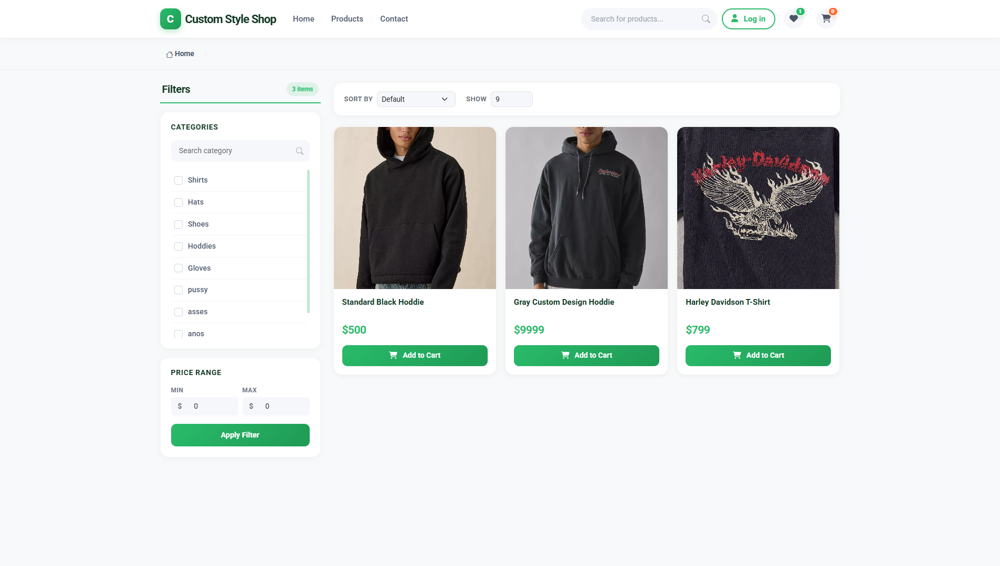
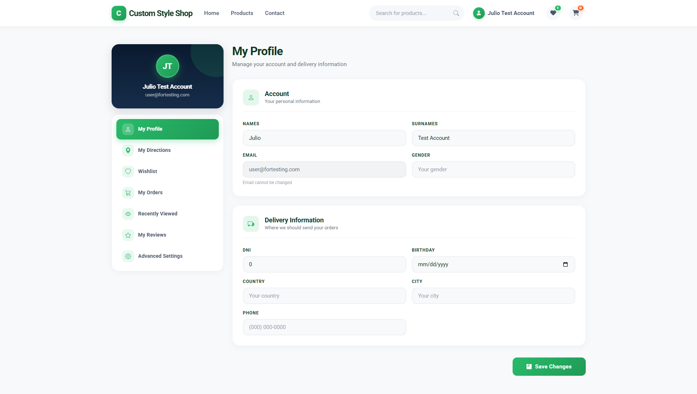

# 🛒 E-Commerce & Admin Panel Demo

[](#español)
[](#english)

---

<a name="español"></a>

## 🇪🇸 Español

### Descripción del Proyecto

Esta es una aplicación de demostración (_Demo_) full-stack para una tienda de comercio electrónico que cuenta con dos clientes/interfaces principales: la **Tienda Principal (Ecommerce)** para los clientes finales y el **Panel de Administración (Admin Panel)** para la gestión del negocio.

> ⚠️ **Nota Importante de Demostración:**
> Este proyecto es exclusivamente una versión demo con fines educativos y de portafolio. **No se procesan pagos reales**. Las integraciones con **Stripe** y **PayPal** utilizan credenciales en modo de prueba (_sandbox/test keys_).

---

### Características Principales

#### 1. Tienda de Comercio Electrónico (Cliente)

- **Sincronización en Tiempo Real:** Actualización de carritos de compra e inventario en tiempo real mediante WebSockets.
- **Pasarelas de Pago (Modo Prueba):** Integración ficticia/testing con **Stripe** y **PayPal**.
- **Lista de Deseos / Favoritos:** Guarda productos preferidos.
- **Gestión de Usuarios:** Registro, inicio de sesión y edición de perfil.
- **Gestión de Envíos:** Administración de direcciones de entrega e historial de pedidos/compras.
- **Reseñas y Calificaciones:** Lectura de valoraciones en productos y opción de dejar reseñas únicamente tras haber completado una compra del producto.
- **Soporte y Preguntas Frecuentes:** Sección de FAQ y formulario de contacto directo con soporte.

### Capturas de pantalla








#### 2. Panel de Administración (Admin Panel)

- **Dashboard:** Resumen métrico sencillo con estadísticas clave de ventas y rendimiento.
- **Gestión de Productos (CRUD):** Creación, edición, eliminación y subida/gestión de imágenes de productos.
- **Gestión de Clientes:** Listado, adición, actualización y eliminación de usuarios registrados.
- **Cupones de Descuento:** Creación y administración de cupones basados en valor fijo o porcentaje.
- **Bandeja de Entrada de Soporte:** Gestión y visualización de los mensajes recibidos desde la sección _"Contáctanos"_.
- **Configuración General:** Personalización del ecommerce (nombre de la tienda, logo, temas/diseño e información fiscal).

---

### Configuración e Instalación

1. **Clonar el repositorio:**

   ```bash
   git clone https://github.com/tu-usuario/tu-repositorio.git
   cd tu-repositorio
   ```

2. **Instalar dependencias:**

   ```bash
   # En la carpeta de la app o subcarpetas según tu estructura
   npm install
   ```

3. **Variables de Entorno:**
   Crea un archivo `.env` en los módulos correspondientes usando credenciales de prueba para Stripe y PayPal:

   ```env
   STRIPE_TEST_PUBLIC_KEY=pk_test_...
   STRIPE_TEST_SECRET_KEY=sk_test_...
   PAYPAL_TEST_CLIENT_ID=sb_...
   ```

4. **Ejecutar el proyecto:**
   ```bash
   npm run dev
   ```

---

<br />

---

<a name="english"></a>

## 🇬🇧 English

### 📌 Project Overview

This project is a full-stack e-commerce demo application featuring two main client interfaces: the **Customer E-Commerce Storefront** and the **Admin Panel** for comprehensive store management.

> ⚠️ **Important Demo Notice:**
> This application is strictly a demonstration project for portfolio/educational purposes. **No real transactions are processed**. All payment integrations with **Stripe** and **PayPal** operate using test/sandbox environment keys.

---

### Key Features

#### 1. E-Commerce Storefront (Customer Interface)

- **Real-time Sockets:** Cart updates and stock management handled via WebSockets.
- **Payment Gateways (Test Mode):** Integrated testing flows for **Stripe** and **PayPal**.
- **Wishlist / Favorites:** Feature to save preferred items.
- **User Authentication:** Registration, login, and profile editing.
- **Shipping & Order History:** Shipping address management and detailed order tracking.
- **Product Reviews:** Customers can read product reviews and submit their own rating/review after purchasing an item.
- **Support & FAQ:** Dedicated FAQ section and direct customer support contact form.

#### 2. Admin Panel (Management Interface)

- **Dashboard:** Simple visual overview of store sales metrics and order stats.
- **Product Management (CRUD):** Add, edit, delete, and upload images for products.
- **Customer Management:** List, add, update, and remove registered user accounts.
- **Coupon System:** Create and manage promotional coupons with fixed amount or percentage discounts.
- **Support Messages Inbox:** View and respond to inquiries received from the _"Contact Us"_ form.
- **General Settings:** Store-wide configuration including logo, branding design, store name, and tax/fiscal information.

---

### Setup & Installation

1. **Clone the repository:**

   ```bash
   git clone https://github.com/subl-1me/ecommerce-app.git
   cd ecommerce-app
   ```

2. **Install dependencies:**

   ```bash
   pnpm install
   ```

3. **Environment Variables:**
   Create a `.env` file in the appropriate directory using Stripe and PayPal sandbox keys:

   ```env
   STRIPE_TEST_PUBLIC_KEY=pk_test_...
   STRIPE_TEST_SECRET_KEY=sk_test_...
   PAYPAL_TEST_CLIENT_ID=sb_...
   ```

4. **Run the application:**
   ```bash
   npm run dev
   ```

---

### 📄 License

This project is open source and available under the [MIT License](LICENSE).
